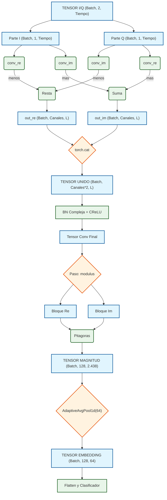

```mermaid
flowchart TD
    classDef t fill:#e1f5fe,stroke:#01579b,stroke-width:2px;
    classDef l fill:#fff3e0,stroke:#e65100,stroke-width:2px;
    classDef o fill:#e8f5e9,stroke:#1b5e20,stroke-width:2px;
    
    A["TENSOR I/Q (Batch, 2, Tiempo)"]:::t --> B1["Parte I (Batch, 1, Tiempo)"]:::t
    A --> B2["Parte Q (Batch, 1, Tiempo)"]:::t

    B1 --> C1("conv_re"):::o
    B2 --> C2("conv_im"):::o
    B2 --> C3("conv_re"):::o
    B1 --> C4("conv_im"):::o
    
    C1 -->|menos| D1("Resta"):::o
    C2 -->|menos| D1
    C3 -->|mas| D2("Suma"):::o
    C4 -->|mas| D2
    
    D1 --> E1["out_re (Batch, Canales, L)"]:::t
    D2 --> E2["out_im (Batch, Canales, L)"]:::t

    E1 --> F{"torch.cat"}:::l
    E2 --> F
    
    F --> G["TENSOR UNIDO (Batch, Canales*2, L)"]:::t
    G --> H["BN Compleja + CReLU"]:::o
    H --> I["Tensor Conv Final"]:::t

    I --> J{"Paso: modulus"}:::l
    J --> K1["Bloque Re"]:::t
    J --> K2["Bloque Im"]:::t
    
    K1 --> L("Pitagoras"):::o
    K2 --> L
    L --> M["TENSOR MAGNITUD (Batch, 128, 2.438)"]:::t
    
    M --> N{"AdaptiveAvgPool1d(64)"}:::l
    N --> O["TENSOR EMBEDDING (Batch, 128, 64)"]:::t
    O --> P["Flatten y Clasificador"]:::o
```
