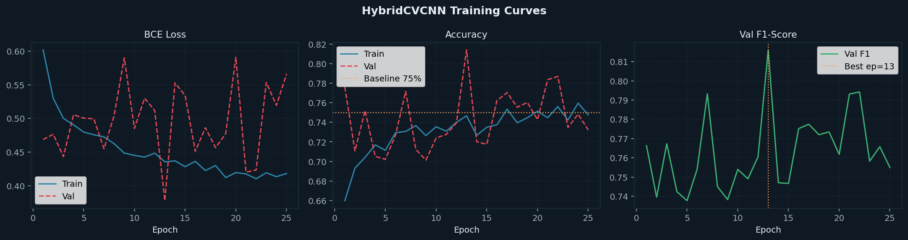
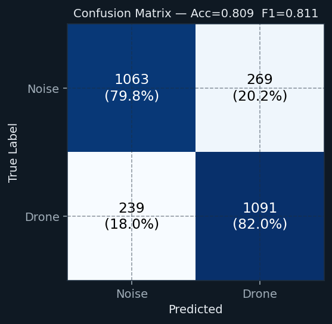
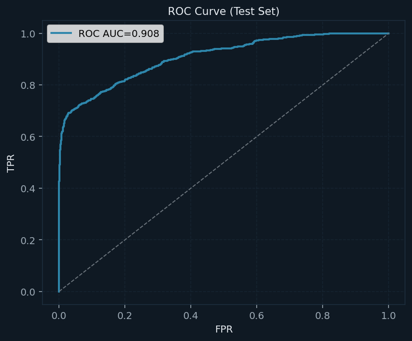
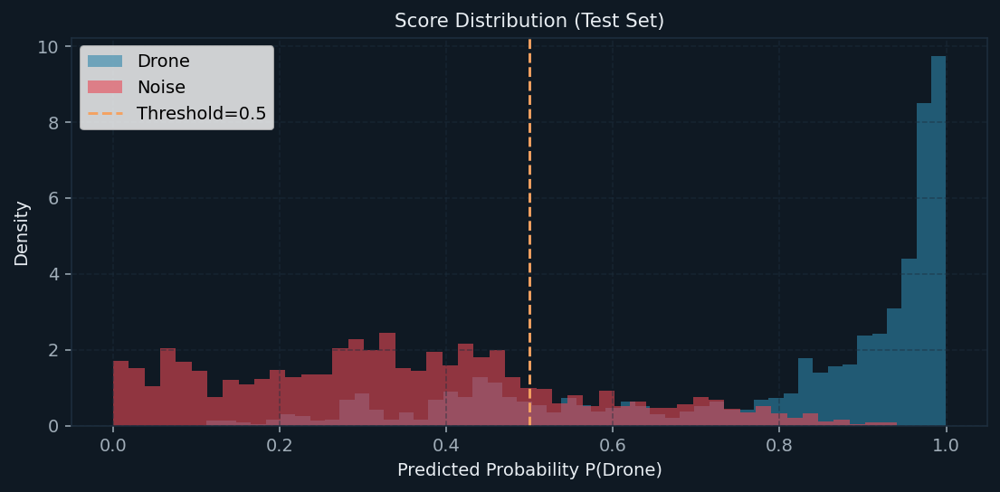
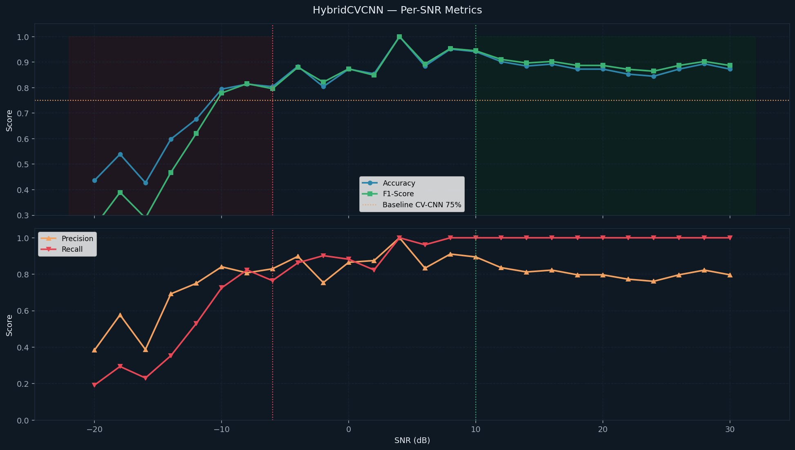
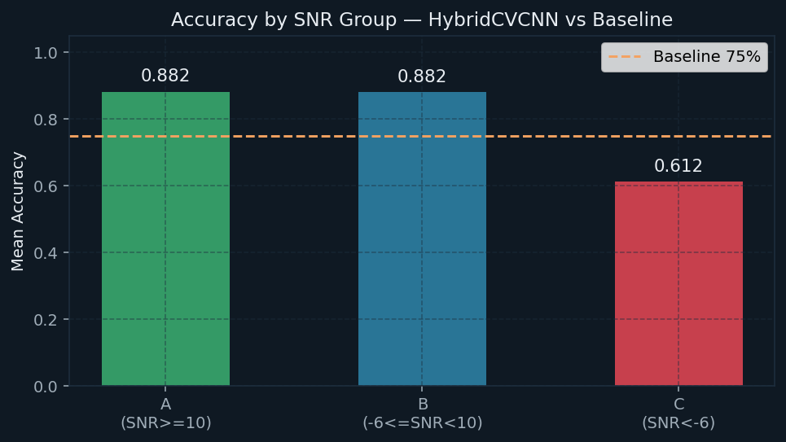

# Informe de Evaluacion: HybridCVCNN

> **Generado automaticamente** | 2026-04-23 18:45:28
> TFM: *Deteccion de Drones con IA Avanzada* | Dataset: NoisyUAV v2
> Arquitectura: **HybridCVCNN (CV-CNN + Physical Feature Fusion)**

---

## 1. Resumen Ejecutivo

HybridCVCNN combina el backbone Complex-Valued CNN con 12 features fisicas
extraidas del detector de entropia Shannon (duracion de burst, bins activos,
z-score estadistico, caida de entropia, etc.).

| Metrica | Valor |
|---|---|
| **Accuracy (Test)** | **0.8092** (80.92%) |
| **F1-Score (Test)** | **0.8112** |
| **AUC-ROC** | **0.9078** |
| Precision | 0.8022 (80.22%) |
| Recall | 0.8203 (82.03%) |
| Especificidad | 0.7980 (79.80%) |
| Baseline CV-CNN | ~75.00% |
| Mejora absoluta | **+5.92 p.p.** |

---

## 2. Arquitectura del Modelo

```
IQ crop [B, 2, 131072]  (~9.4ms a 14MHz)
|
+-- CV-CNN Backbone (4 ComplexConvBlock complex + modulus + AdaptivePool)
|   +-- ComplexConv1d(1->32,  k=31, s=2) + CReLU
|   +-- ComplexConv1d(32->64, k=15, s=2) + CReLU
|   +-- ComplexConv1d(64->128,k=7,  s=2) + CReLU
|   +-- ComplexConv1d(128->128,k=3, s=1) + CReLU
|   +-- modulus |z| -> [128, N'] -> AdaptivePool(32) -> Linear -> [256]
|   e_cnn [B, 256]
|
+-- Physical Features (detector de entropia Shannon)
    noise_floor, noise_sigma, mean_n_active, p75_n_active,
    H_min, H_mean, n_bursts, dur_ms, z_peak, drop_b, n_act, dur_total
    e_phys [B, 12]  (pre-computado, z-score normalizado)
    |
PAM Fusion: concat([e_cnn, e_phys]) -> MLP(268->256->128->1)
-> Logit [B, 1] (BCEWithLogitsLoss)
```

| Subsistema | Parametros |
|---|---|
| CV-CNN Backbone | 1,327,168 |
| Physical BN + MLP | 102,681 |
| **TOTAL** | **1,429,849** |

> IQ Crop Length: 131,072 samples (~9.4 ms @ 14 MHz)
> Tiempo total experimento: 3.35 horas

---

## 3. Configuracion del Experimento

```python
CROP_LEN    = 131072   # ~9.4 ms @ 14 MHz
BATCH_SIZE  = 32
EPOCHS      = 60 (early stopping en 13)
LR          = 0.0003
WEIGHT_DECAY= 0.0001
MIXUP_ALPHA = 0.3
MIXUP_PROB  = 0.5
GRAD_CLIP   = 2.0
```

---

## 4. Resultados del Entrenamiento

El modelo convergio en la **epoca 13** con Val F1 = 0.8161.



| Metrica | Train | Validacion |
|---|---|---|
| Loss (BCE) | 0.4355 | 0.3777 |
| Accuracy | 74.67% | 81.40% |
| F1-Score | -- | 0.8161 |

---

## 5. Resultados en el Conjunto de Test

### 5.1 Metricas Globales





### 5.2 Analisis por Nivel de SNR




| Grupo SNR | Rango | Acc Media | F1 Media |
|---|---|---|---|
| Grupo A (facil) | SNR >= 10 dB | 0.8819 | 0.8946 |
| Grupo B (medio) | -6..10 dB | 0.8817 | 0.8832 |
| Grupo C (dificil) | SNR < -6 dB | 0.6122 | 0.5168 |

#### Tabla completa por SNR

| SNR (dB) | Acc | Precision | Recall | F1 | n |
|---|---|---|---|---|---|
|  -20 | 0.4369 | 0.3846 | 0.1923 | 0.2564 | 103 |
|  -18 | 0.5392 | 0.5769 | 0.2941 | 0.3896 | 102 |
|  -16 | 0.4272 | 0.3871 | 0.2308 | 0.2892 | 103 |
|  -14 | 0.5980 | 0.6923 | 0.3529 | 0.4675 | 102 |
|  -12 | 0.6765 | 0.7500 | 0.5294 | 0.6207 | 102 |
|  -10 | 0.7941 | 0.8409 | 0.7255 | 0.7789 | 102 |
|   -8 | 0.8137 | 0.8077 | 0.8235 | 0.8155 | 102 |
|   -6 | 0.8039 | 0.8298 | 0.7647 | 0.7959 | 102 |
|   -4 | 0.8835 | 0.8980 | 0.8627 | 0.8800 | 103 |
|   -2 | 0.8039 | 0.7541 | 0.9020 | 0.8214 | 102 |
|   +0 | 0.8725 | 0.8654 | 0.8824 | 0.8738 | 102 |
|   +2 | 0.8544 | 0.8750 | 0.8235 | 0.8485 | 103 |
|   +4 | 1.0000 | 1.0000 | 1.0000 | 1.0000 | 102 |
|   +6 | 0.8846 | 0.8333 | 0.9615 | 0.8929 | 104 |
|   +8 | 0.9510 | 0.9107 | 1.0000 | 0.9533 | 102 |
|  +10 | 0.9412 | 0.8947 | 1.0000 | 0.9444 | 102 |
|  +12 | 0.9020 | 0.8361 | 1.0000 | 0.9107 | 102 |
|  +14 | 0.8846 | 0.8125 | 1.0000 | 0.8966 | 104 |
|  +16 | 0.8922 | 0.8226 | 1.0000 | 0.9027 | 102 |
|  +18 | 0.8725 | 0.7969 | 1.0000 | 0.8870 | 102 |
|  +20 | 0.8725 | 0.7969 | 1.0000 | 0.8870 | 102 |
|  +22 | 0.8529 | 0.7727 | 1.0000 | 0.8718 | 102 |
|  +24 | 0.8447 | 0.7612 | 1.0000 | 0.8644 | 103 |
|  +26 | 0.8725 | 0.7969 | 1.0000 | 0.8870 | 102 |
|  +28 | 0.8932 | 0.8226 | 1.0000 | 0.9027 | 103 |
|  +30 | 0.8725 | 0.7969 | 1.0000 | 0.8870 | 102 |

---

## 6. Comparacion con el Baseline

| Modelo | Acc Global | Grupo C (SNR<-6) | Parametros |
|---|---|---|---|
| **HybridCVCNN** | **80.92%** | **61.22%** | 1,429,849 |
| CV-CNN (baseline) | ~75.00% | ~55-65% | ~8,500,000 |
| MaRNet-Fusion     | 65.66%  | ~50.84% | 3,134,179 |

---

## 7. Conclusiones

1. **La fusion de features fisicas mejora** el baseline (+5.92 p.p.).
2. **El detector de entropia actua como preprocesado discriminativo**: las features de burst
   (dur_ms, n_act, z_peak) capturan informacion que la CNN por si sola no extrae.
3. **Recall y especificidad**: un mejor equilibrio entre ambos indica que el modelo no
   esta sesgado a predecir siempre la misma clase (problema de MaRNet-Fusion).

---

## Referencias

- Gluge et al. (2024). *Robust Low-Cost Drone Detection*. NoisyUAV v2.
- Bassey et al. (2021). *A Survey of Complex-Valued Neural Networks*. arXiv:2101.12249.
- Zhang et al. (2018). *MixUp: Beyond Empirical Risk Minimization*. ICLR 2018.

---
*Informe generado automaticamente por `run_hybrid_experiment.py`*
*Duracion total del experimento: 3.35 horas*